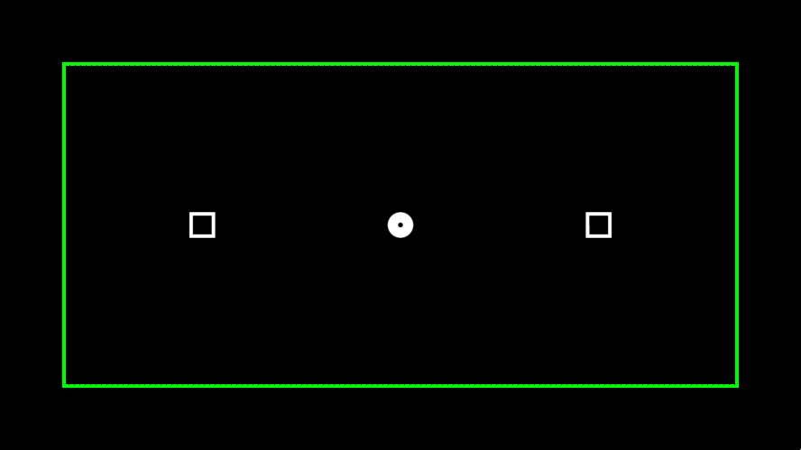

# TaskSwitching

[](https://doi.org/10.1098/rsos.190134)
[](https://osf.io/ry9vm/) 

TaskSwitching is an experiment program designed as a follow-up to the task used in [Posner, Klein, Summers, and Buggie (1973)](https://doi.org/10.3758/BF03198062), exploring how exogenous and endogenous alerting affect accuracy and reaction times. All raw data and code necessary to reproduce the analyses for the related manuscript can be found on OSF [here](https://osf.io/ry9vm/).



In this experiment, randomly-generated white noise is played constantly through the left and right audio channels. After a random delay between 2000 and 6000 ms, a target appears in either the left or right box. This target is preceeded by a 100ms auditory alerting signal (endogenous or exogenous, depending on the condition) on 75% of trials. The interval between the onsets of the signal and the target can be 850ms, 250ms, 100ms (target appears immediately after signal ends), or 0ms (no alerting signal), changing to a new interval every 16 trials, and varying randomly in order within a block.

Every 8 trials, the border around the stimuli changes colours to indicate the required response to targets, with a green border informing participants to press the response key on the same side as the target (a congruent response) and a red border informing them to press the response key on the opposite side of the target (an incongruent response). Response feedback is presented on every trial for 1000ms before the next trial begins.

**NOTE**: This experiment program has been slightly modified from its original version. Specifically, it has been modified to ask participants their gender instead of their sex during demographics collection, and has been updated to be better compatible with recent versions of KLibs.

## Requirements

TaskSwitching is programmed in Python 2.7 using the [KLibs framework](https://github.com/a-hurst/klibs). It has been developed and tested on macOS (10.9 through 10.13), but should also work with minimal hassle on computers running [Ubuntu](https://www.ubuntu.com/download/desktop) or [Debian](https://www.debian.org/distrib/) Linux, as well as on computers running Windows 7 or newer with [a bit more effort](https://github.com/a-hurst/klibs/wiki/Installation-on-Windows).

## Getting Started

### Installation

First, you will need to install the KLibs framework by following the instructions [here](https://github.com/a-hurst/klibs).

Then, you can then download and install the experiment program with the following commands (replacing `~/Downloads` with the path to the folder where you would like to put the program folder):

```
cd ~/Downloads
git clone https://github.com/TheKleinLab/TaskSwitching.git
```

### Running the Experiment

TaskSwitching is a KLibs experiment, meaning that it is run using the `klibs` command at the terminal (running the 'experiment.py' file using python directly will not work).

To run the experiment, navigate to the TaskSwitching folder in Terminal and run `klibs run [screensize]`,
replacing `[screensize]` with the diagonal size of your display in inches (e.g. `klibs run 24` for a 24-inch monitor). If you just want to test the program out for yourself and skip demographics collection, you can add the `-d` flag to the end of the command to launch the experiment in development mode.

#### Optional Settings

In the experiment, participants are placed into one of two conditions: the **exogenous** signal conditon, where alerting signals consist of a brief doubling of the noise volume, or the **endogenous** signal condition, where alerting signals consist of a brief change in the noise from identical in both ears to different in both ears with no change in intensity.

To choose which condition to run, launch the experiment with the `--condition` or `-c` flag, followed by either `exo` or `endo`. For example, if you wanted to run the endogenous signal condition on a computer with a 19-inch monitor, you would run

```
klibs run 19 --condition endo
```

If no condition is manually specified, the experiment program defaults to running the exogenous signal condition.

### Exporting Data

To export data from TaskSwitching, simply run

```
klibs export
```
while in the TaskSwitching directory. This will export the trial data for each participant into individual tab-separated text files in the project's `ExpAssets/Data` subfolder.
